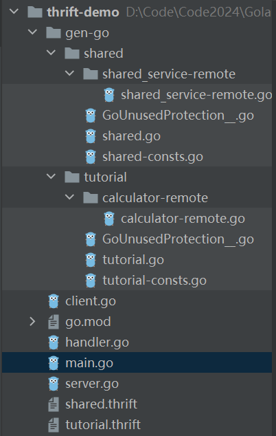
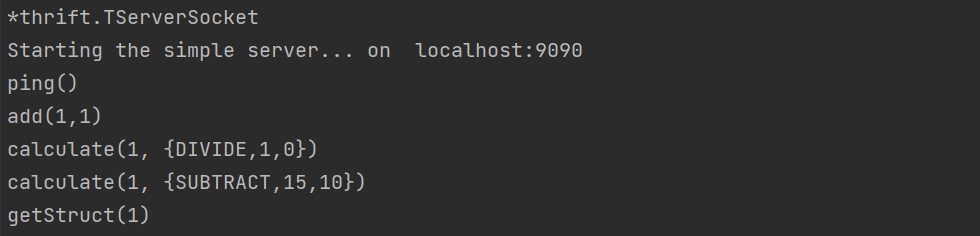
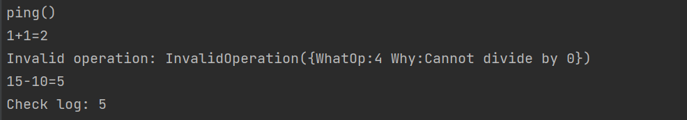

## Thrift

把https://thrift.apache.org/tutorial/go.html中shared.thrift 和 tutorial.thrift 拷贝到项目，生成go代码：

```
thrift -r --gen go tutorial.thrift
```



- remote：客户端示例代码
- const：常量所在文件

服务端启动：

```
go run main.go server.go client.go handler.go
```

客户端启动：修改main.go中server为false，依然运行：

```
go run main.go server.go client.go handler.go
```

运行结果：





TODO：支持的传输格式，数据传输方式，服务模型，数据类型。